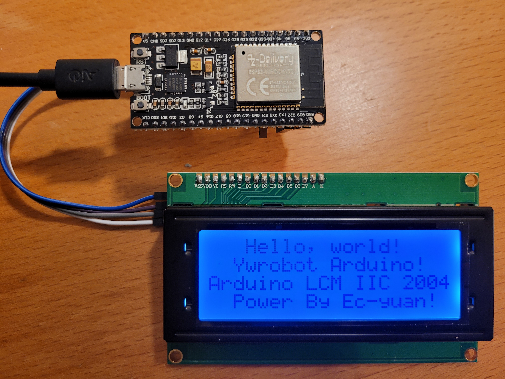

# ESP32-HD44780
Code copié depuis LiquidCrystal_I2C/examples/HelloWorld

https://github.com/johnrickman/LiquidCrystal_I2C/blob/master/examples/HelloWorld/HelloWorld.pde

Le code a été écrit à l'aide de Visual Studio Code.

Pour ceux qui utilisent Arduino IDE, il faut supprimer la ligne 1 après le copier/coller :

        #include <Arduino.h>

## Montage
- ESP32 WROOM 32
- HD44780
- LCD Display 40x2

### Détails des connexions
|ESP32|HD44780|
|------|---|
|3.3V | VCC|
|GND | GND|
|GPIO21 (SDA) | SDA|
|GPIO22 (SCL) | SCL|

## Illustration

### Librairies
- marcoschwartz/LiquidCrystal_I2C@^1.1.4 [Github repository](https://github.com/johnrickman/LiquidCrystal_I2C)
